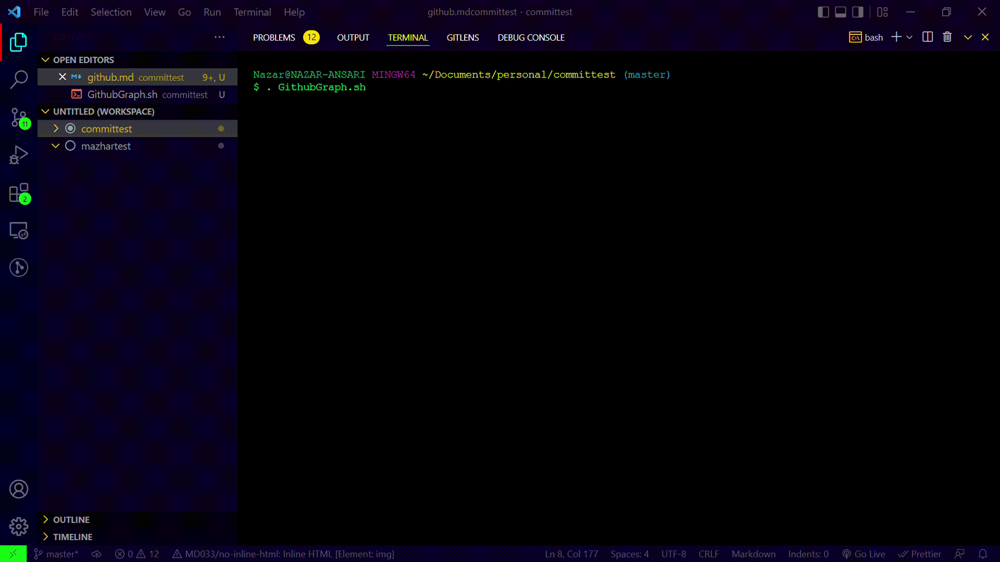
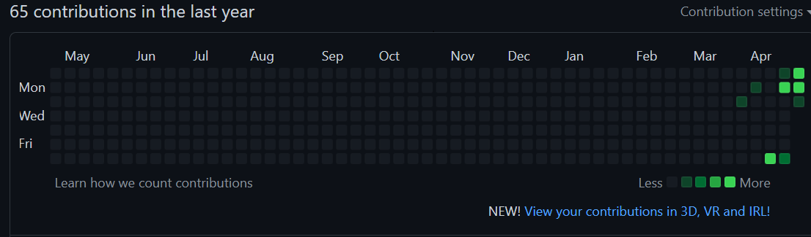
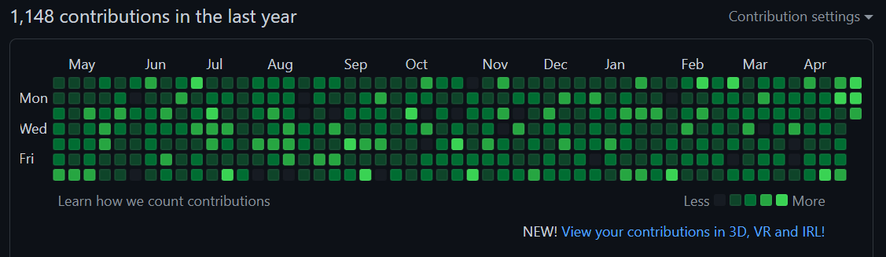

<hr>

# **_🦑Github Contribution Graph Modifier🦑_**
<hr>

## **_Short Info About Project :_**

- :one: `This Script is made completely for education purpose and not for spamming` _**"Github"**_**.**
- :two: `Logic Behind this script is to make random commits per month which lead to uniquely balanced the "GRAPH"`**.**
- **Feature :**  `Once you run the script you don't event need to open your profile This SCRIPT will gonna done it for you Irrespective of the Running ` _**"Operating System"**_**.**
## **_Preview :_**
<div style="box-shadow:1px 1px 1px green , 2px 2px 2px yellow , 2px 2px 2px red ,2px 2px 2px blue ; padding-bottom:0px ; height:380px ; width:670px">
</div><hr>

## **_Steps To Done On Your System:_**

- ```bash
  cd ~/
  git clone https://github.com/nazar-ansari/Github-Graph-Modifier.git 
  cd Github-Graph-Modifier
  cd src
  . RunScript.sh
  
  ```
 **NOTE:** It Will Simply Ask To paste The Link of Your **Repository** & Further The Number of **Commits**
  ```bash
                         - - - - - - - - - - - - - - - - - - - - - - - - - - 
                        |    Paste The Remote U.R.L Of The Your Repository  |
                         - - - - - - - - - - - - - - - - - - - - - - - - - - 

    https://github.com/nazar-ansari/samplecommittest.git
  ```
  ```bash
                          Enter The Total Number of "COMMITS" You Want To Be Proced :
  800

  ```
  >Now Just Wait For The Timer To be **"1 s"**
##    🤯B O O M 🤯
### _**From 👇**_


### _**To 👇**_


<hr>

#### 👨‍💻Feel Free To Contirbute To This Project With Respective To Github Guidelines👨‍💻
**Copyright :copyright: :** _[Nazar Ansari](./LICENSE)_
